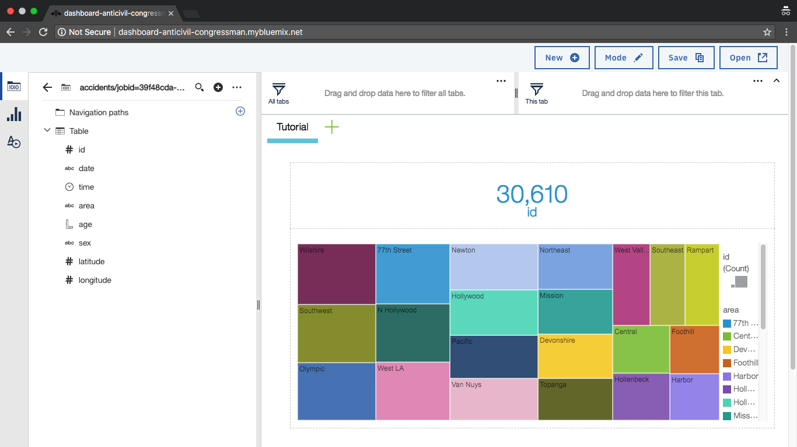

# Data Dashboard

Sample and tutorial that creates interactive dashboards using: Dynamic Dashboard Embedded, Cloud Object Storage, SQL Query, DB2 Warehouse and AppID. Not all services are required, see tutorials for possible use cases and guidance.



The solution works out of the box when following the [Build a smart data lake]() tutorial. For customization, see the below notes.

## Running the solution

This solution uses an Angular web cient and server to provide APIs and host the web app. Before hosting in production, you must build the Angular web client.

| Command       | Usage                                           |
|---------------|-------------------------------------------------|
| npm start     | Runs server (requires pre-built web client)     |
| npm run prod  | Builds web client and runs server               |
| npm run dev   | Runs web client and server in dev (reload) mode |
| npm run push  | Builds web client and pushes to IBM Cloud       |

## Server-side

The solution uses [Express](http://expressjs.com/) to deliver IBM Cloud services. Services are auto-discovered using [cfenv](https://www.npmjs.com/package/cfenv), which requires the appropriate service bindings to exist in production or a local `vcap-services.json` file during development.

| Service                    | Name                   | Middleware      | Usage                                                 |
|----------------------------|------------------------|-----------------|-------------------------------------------------------|
| AppID                      | dashboard-nodejs-appid | server-appid.js | Provides authentication support for web client        |
| Cloud Object Storage       | dashboard-nodejs-cos   | server-cos.js   | Provides DDE compatible datasources                   |
| DB2 Warehouse on Cloud     | dashboard-nodejs-db2   | server-db2.js   | Provides DDE compatible datasources (with encryption) |
| Dynamic Dashboard Embedded | dashboard-nodejs-dde   | server-dde.js   | Provides DDE sessions for web client                  |

Ensure that the `manifest.yml` file contains entries for corresponding services. By default, the solution is configured with Object Storage.

```
services:
  - dashboard-nodejs-dde
  - dashboard-nodejs-cos
```

To use DB2, make the following change.

```
services:
  - dashboard-nodejs-dde
  - dashboard-nodejs-db2
```

## Client-side

The client is an Angular web client that automatically sets up a Dynamic Dashboard Embedded (DDE) session. Data for DDE can come from either IBM Cloud Object Storage or DB2 Warehouse on Cloud. Two `DDEAdapter` adapters exist to support these two backends, which will be loaded depending on whether the respective service is available on the server. Similarly, a `Login` button will load when the AppID service is available.

After a user has authored a dashboard, the dashboard can be saved and restored from browser storage.

## Local development
During development use the `dev` script. This will launch `ng serve` and `nodemon` to automatically restart the app when changes occur.

1. Copy the VCAP_SERVICES to the local sample application.
  - In the browser, go to https://console.bluemix.net/dashboard/apps and select the deployed `dashboard-nodejs` application. Click **Runtime** -> **Environment variables**. Alternatively, use the command `bx app env dashboard-nodejs` to view environment variables.
  - Copy the VCAP_SERVICES to the clipboard using the copy button.
  - Paste the VCAP_SERVICES content to the sample applications `vcap-services.json` file overwriting existing content and save.
2. Run `npm run dev`.
3. Browse to http://localhost:4200. If Express is not listening on http://localhost:6008, update the properties in `/src/environments/environment.ts`.

The Dynamic Dashboard Embedded service connects directly to CSV or JDBC datasources via a public URLs. To support access during local development, you should use a tool like [ngrok](https://ngrok.com/) to open a tunnel to the Express server. The `sourceUrl` property should be updated to reflect the ngrok URL in `/src/environments/environment.ts`.

## License

Licensed under the Apache License, Version 2.0 (the "License"); you may not use this file except in compliance with the License. You may obtain a copy of the License at

http://www.apache.org/licenses/LICENSE-2.0

Unless required by applicable law or agreed to in writing, software distributed under the License is distributed on an "AS IS" BASIS, WITHOUT WARRANTIES OR CONDITIONS OF ANY KIND, either express or implied. See the License for the specific language governing permissions and limitations under the License.

